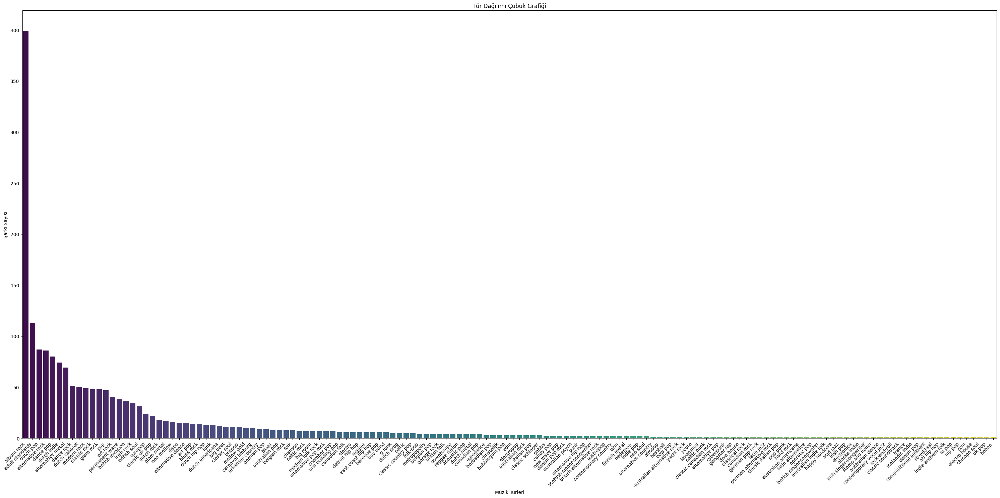
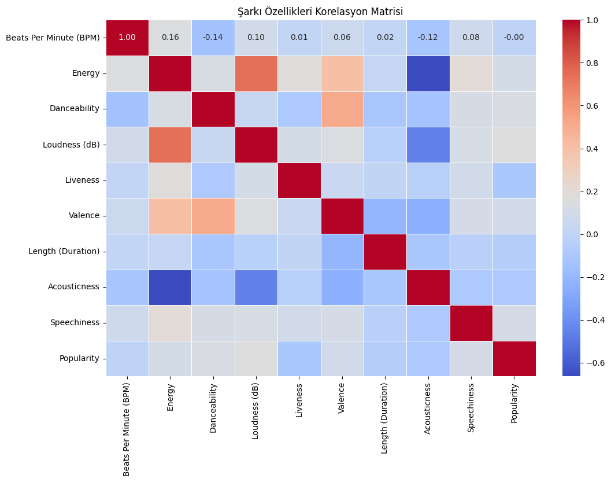
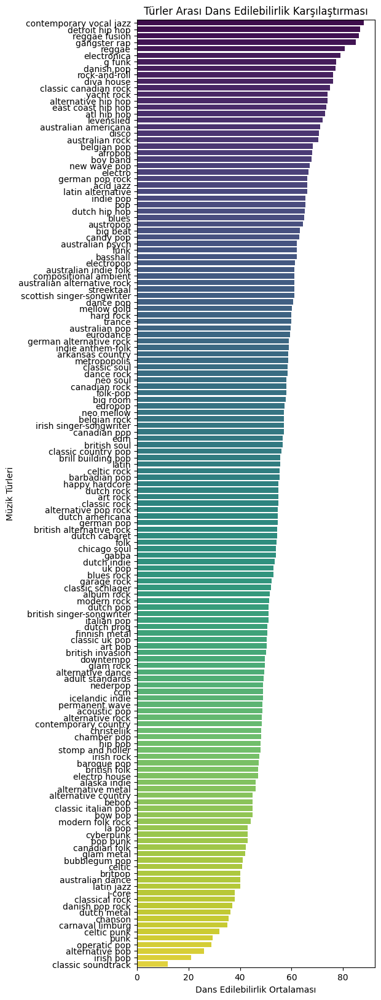
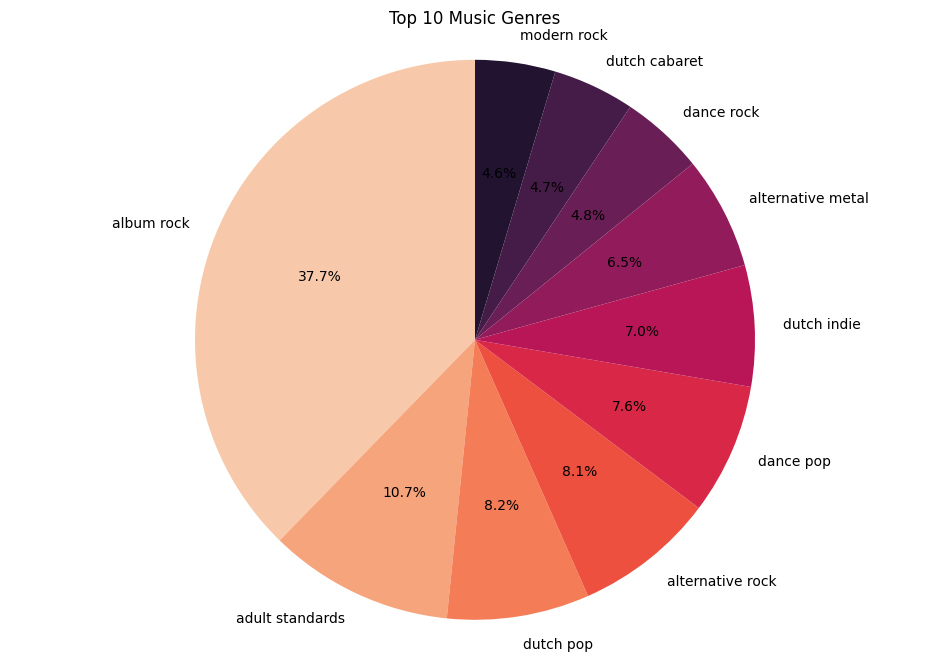

# Kütüphanelerin import edilmesi


```python
import pandas as pd
import matplotlib.pyplot as plt
import seaborn as sns
```

    C:\Users\senae\anaconda3\lib\site-packages\scipy\__init__.py:146: UserWarning: A NumPy version >=1.16.5 and <1.23.0 is required for this version of SciPy (detected version 1.24.3
      warnings.warn(f"A NumPy version >={np_minversion} and <{np_maxversion}"
    

# Veri setinin yüklenmesi


```python
# Veri seti yükleme
df = pd.read_csv('C:\\Users\\senae\\Proje\\Spotify-2000.csv')
```

# İlk 5 verinin gösterimi


```python
# İlk 5 veri
print(df.head(5))
```

      Index                   Title             Artist            Top Genre  \
    0     1                 Sunrise        Norah Jones      adult standards   
    1     2             Black Night        Deep Purple           album rock   
    2     3          Clint Eastwood           Gorillaz  alternative hip hop   
    3     4           The Pretender       Foo Fighters    alternative metal   
    4     5  Waitin' On A Sunny Day  Bruce Springsteen         classic rock   
    
         Year  Beats Per Minute (BPM)  Energy  Danceability  Loudness (dB)  \
    0  2004.0                   157.0    30.0          53.0          -14.0   
    1  2000.0                   135.0    79.0          50.0          -11.0   
    2  2001.0                   168.0    69.0          66.0           -9.0   
    3  2007.0                   173.0    96.0          43.0           -4.0   
    4  2002.0                   106.0    82.0          58.0           -5.0   
    
       Liveness  Valence  Length (Duration)  Acousticness  Speechiness  Popularity  
    0      11.0     68.0              201.0          94.0          3.0        71.0  
    1      17.0     81.0              207.0          17.0          7.0        39.0  
    2       7.0     52.0              341.0           2.0         17.0        69.0  
    3       3.0     37.0              269.0           0.0          4.0        76.0  
    4      10.0     87.0              256.0           1.0          3.0        59.0  
    

# DataFrame içindeki veriler hakkında temel bilgiler


```python
df.info()
```

    <class 'pandas.core.frame.DataFrame'>
    RangeIndex: 1994 entries, 0 to 1993
    Data columns (total 15 columns):
     #   Column                  Non-Null Count  Dtype  
    ---  ------                  --------------  -----  
     0   Index                   1994 non-null   object 
     1   Title                   1937 non-null   object 
     2   Artist                  1937 non-null   object 
     3   Top Genre               1937 non-null   object 
     4   Year                    1937 non-null   float64
     5   Beats Per Minute (BPM)  1937 non-null   float64
     6   Energy                  1937 non-null   float64
     7   Danceability            1937 non-null   float64
     8   Loudness (dB)           1937 non-null   float64
     9   Liveness                1937 non-null   float64
     10  Valence                 1937 non-null   float64
     11  Length (Duration)       1937 non-null   float64
     12  Acousticness            1937 non-null   float64
     13  Speechiness             1937 non-null   float64
     14  Popularity              1937 non-null   float64
    dtypes: float64(11), object(4)
    memory usage: 233.8+ KB
    

# Veri setinin genel dağılımı ve istatistiksel özellikleri


```python
df.describe()
```


<div>
<style scoped>
    .dataframe tbody tr th:only-of-type {
        vertical-align: middle;
    }

    .dataframe tbody tr th {
        vertical-align: top;
    }

    .dataframe thead th {
        text-align: right;
    }
</style>
<table border="1" class="dataframe">
  <thead>
    <tr style="text-align: right;">
      <th></th>
      <th>Year</th>
      <th>Beats Per Minute (BPM)</th>
      <th>Energy</th>
      <th>Danceability</th>
      <th>Loudness (dB)</th>
      <th>Liveness</th>
      <th>Valence</th>
      <th>Length (Duration)</th>
      <th>Acousticness</th>
      <th>Speechiness</th>
      <th>Popularity</th>
    </tr>
  </thead>
  <tbody>
    <tr>
      <th>count</th>
      <td>1937.000000</td>
      <td>1937.000000</td>
      <td>1937.000000</td>
      <td>1937.000000</td>
      <td>1937.000000</td>
      <td>1937.000000</td>
      <td>1937.000000</td>
      <td>1937.000000</td>
      <td>1937.000000</td>
      <td>1937.000000</td>
      <td>1937.000000</td>
    </tr>
    <tr>
      <th>mean</th>
      <td>1993.173980</td>
      <td>120.175529</td>
      <td>59.784202</td>
      <td>53.305111</td>
      <td>-8.982963</td>
      <td>18.658751</td>
      <td>49.340217</td>
      <td>260.535364</td>
      <td>28.782654</td>
      <td>4.994837</td>
      <td>59.503872</td>
    </tr>
    <tr>
      <th>std</th>
      <td>16.031419</td>
      <td>27.977082</td>
      <td>22.216973</td>
      <td>15.367682</td>
      <td>3.637673</td>
      <td>16.247750</td>
      <td>24.829156</td>
      <td>81.760768</td>
      <td>28.977152</td>
      <td>4.407916</td>
      <td>14.338734</td>
    </tr>
    <tr>
      <th>min</th>
      <td>1956.000000</td>
      <td>37.000000</td>
      <td>3.000000</td>
      <td>10.000000</td>
      <td>-27.000000</td>
      <td>2.000000</td>
      <td>3.000000</td>
      <td>2.000000</td>
      <td>0.000000</td>
      <td>2.000000</td>
      <td>11.000000</td>
    </tr>
    <tr>
      <th>25%</th>
      <td>1979.000000</td>
      <td>99.000000</td>
      <td>42.000000</td>
      <td>43.000000</td>
      <td>-11.000000</td>
      <td>9.000000</td>
      <td>29.000000</td>
      <td>212.000000</td>
      <td>3.000000</td>
      <td>3.000000</td>
      <td>50.000000</td>
    </tr>
    <tr>
      <th>50%</th>
      <td>1994.000000</td>
      <td>119.000000</td>
      <td>61.000000</td>
      <td>53.000000</td>
      <td>-8.000000</td>
      <td>12.000000</td>
      <td>47.000000</td>
      <td>245.000000</td>
      <td>18.000000</td>
      <td>4.000000</td>
      <td>62.000000</td>
    </tr>
    <tr>
      <th>75%</th>
      <td>2008.000000</td>
      <td>136.000000</td>
      <td>78.000000</td>
      <td>64.000000</td>
      <td>-6.000000</td>
      <td>22.000000</td>
      <td>69.000000</td>
      <td>290.000000</td>
      <td>50.000000</td>
      <td>5.000000</td>
      <td>71.000000</td>
    </tr>
    <tr>
      <th>max</th>
      <td>2019.000000</td>
      <td>206.000000</td>
      <td>100.000000</td>
      <td>96.000000</td>
      <td>-2.000000</td>
      <td>99.000000</td>
      <td>99.000000</td>
      <td>966.000000</td>
      <td>98.000000</td>
      <td>55.000000</td>
      <td>100.000000</td>
    </tr>
  </tbody>
</table>
</div>


```python
# Veri setini yükleme
df = pd.read_csv('C:\\Users\\senae\\Proje\\Spotify-2000.csv')

# Index ayarlama
df.set_index('Index', inplace=True)

# Yıl sütununu kaldırma
df.drop(['Year'], axis=1, inplace=True)

# Güncel veri setini gösterme
df.head(5)
```


<div>
<style scoped>
    .dataframe tbody tr th:only-of-type {
        vertical-align: middle;
    }

    .dataframe tbody tr th {
        vertical-align: top;
    }

    .dataframe thead th {
        text-align: right;
    }
</style>
<table border="1" class="dataframe">
  <thead>
    <tr style="text-align: right;">
      <th></th>
      <th>Title</th>
      <th>Artist</th>
      <th>Top Genre</th>
      <th>Beats Per Minute (BPM)</th>
      <th>Energy</th>
      <th>Danceability</th>
      <th>Loudness (dB)</th>
      <th>Liveness</th>
      <th>Valence</th>
      <th>Length (Duration)</th>
      <th>Acousticness</th>
      <th>Speechiness</th>
      <th>Popularity</th>
    </tr>
    <tr>
      <th>Index</th>
      <th></th>
      <th></th>
      <th></th>
      <th></th>
      <th></th>
      <th></th>
      <th></th>
      <th></th>
      <th></th>
      <th></th>
      <th></th>
      <th></th>
      <th></th>
    </tr>
  </thead>
  <tbody>
    <tr>
      <th>1</th>
      <td>Sunrise</td>
      <td>Norah Jones</td>
      <td>adult standards</td>
      <td>157.0</td>
      <td>30.0</td>
      <td>53.0</td>
      <td>-14.0</td>
      <td>11.0</td>
      <td>68.0</td>
      <td>201.0</td>
      <td>94.0</td>
      <td>3.0</td>
      <td>71.0</td>
    </tr>
    <tr>
      <th>2</th>
      <td>Black Night</td>
      <td>Deep Purple</td>
      <td>album rock</td>
      <td>135.0</td>
      <td>79.0</td>
      <td>50.0</td>
      <td>-11.0</td>
      <td>17.0</td>
      <td>81.0</td>
      <td>207.0</td>
      <td>17.0</td>
      <td>7.0</td>
      <td>39.0</td>
    </tr>
    <tr>
      <th>3</th>
      <td>Clint Eastwood</td>
      <td>Gorillaz</td>
      <td>alternative hip hop</td>
      <td>168.0</td>
      <td>69.0</td>
      <td>66.0</td>
      <td>-9.0</td>
      <td>7.0</td>
      <td>52.0</td>
      <td>341.0</td>
      <td>2.0</td>
      <td>17.0</td>
      <td>69.0</td>
    </tr>
    <tr>
      <th>4</th>
      <td>The Pretender</td>
      <td>Foo Fighters</td>
      <td>alternative metal</td>
      <td>173.0</td>
      <td>96.0</td>
      <td>43.0</td>
      <td>-4.0</td>
      <td>3.0</td>
      <td>37.0</td>
      <td>269.0</td>
      <td>0.0</td>
      <td>4.0</td>
      <td>76.0</td>
    </tr>
    <tr>
      <th>5</th>
      <td>Waitin' On A Sunny Day</td>
      <td>Bruce Springsteen</td>
      <td>classic rock</td>
      <td>106.0</td>
      <td>82.0</td>
      <td>58.0</td>
      <td>-5.0</td>
      <td>10.0</td>
      <td>87.0</td>
      <td>256.0</td>
      <td>1.0</td>
      <td>3.0</td>
      <td>59.0</td>
    </tr>
  </tbody>
</table>
</div>


```python
# Eksik değer sayısını gösterme
df.isna().sum()
```


    Title                     57
    Artist                    57
    Top Genre                 57
    Beats Per Minute (BPM)    57
    Energy                    57
    Danceability              57
    Loudness (dB)             57
    Liveness                  57
    Valence                   57
    Length (Duration)         57
    Acousticness              57
    Speechiness               57
    Popularity                57
    dtype: int64


```python
df.dropna(how='any', inplace=True)

# Temizlenmiş veri setini gösterme
print(df.head(5))
df.info()
df.describe()
```

                            Title             Artist            Top Genre  \
    Index                                                                   
    1                     Sunrise        Norah Jones      adult standards   
    2                 Black Night        Deep Purple           album rock   
    3              Clint Eastwood           Gorillaz  alternative hip hop   
    4               The Pretender       Foo Fighters    alternative metal   
    5      Waitin' On A Sunny Day  Bruce Springsteen         classic rock   
    
           Beats Per Minute (BPM)  Energy  Danceability  Loudness (dB)  Liveness  \
    Index                                                                          
    1                       157.0    30.0          53.0          -14.0      11.0   
    2                       135.0    79.0          50.0          -11.0      17.0   
    3                       168.0    69.0          66.0           -9.0       7.0   
    4                       173.0    96.0          43.0           -4.0       3.0   
    5                       106.0    82.0          58.0           -5.0      10.0   
    
           Valence  Length (Duration)  Acousticness  Speechiness  Popularity  
    Index                                                                     
    1         68.0              201.0          94.0          3.0        71.0  
    2         81.0              207.0          17.0          7.0        39.0  
    3         52.0              341.0           2.0         17.0        69.0  
    4         37.0              269.0           0.0          4.0        76.0  
    5         87.0              256.0           1.0          3.0        59.0  
    <class 'pandas.core.frame.DataFrame'>
    Index: 1937 entries, 1 to 1994
    Data columns (total 13 columns):
     #   Column                  Non-Null Count  Dtype  
    ---  ------                  --------------  -----  
     0   Title                   1937 non-null   object 
     1   Artist                  1937 non-null   object 
     2   Top Genre               1937 non-null   object 
     3   Beats Per Minute (BPM)  1937 non-null   float64
     4   Energy                  1937 non-null   float64
     5   Danceability            1937 non-null   float64
     6   Loudness (dB)           1937 non-null   float64
     7   Liveness                1937 non-null   float64
     8   Valence                 1937 non-null   float64
     9   Length (Duration)       1937 non-null   float64
     10  Acousticness            1937 non-null   float64
     11  Speechiness             1937 non-null   float64
     12  Popularity              1937 non-null   float64
    dtypes: float64(10), object(3)
    memory usage: 211.9+ KB
    


<div>
<style scoped>
    .dataframe tbody tr th:only-of-type {
        vertical-align: middle;
    }

    .dataframe tbody tr th {
        vertical-align: top;
    }

    .dataframe thead th {
        text-align: right;
    }
</style>
<table border="1" class="dataframe">
  <thead>
    <tr style="text-align: right;">
      <th></th>
      <th>Beats Per Minute (BPM)</th>
      <th>Energy</th>
      <th>Danceability</th>
      <th>Loudness (dB)</th>
      <th>Liveness</th>
      <th>Valence</th>
      <th>Length (Duration)</th>
      <th>Acousticness</th>
      <th>Speechiness</th>
      <th>Popularity</th>
    </tr>
  </thead>
  <tbody>
    <tr>
      <th>count</th>
      <td>1937.000000</td>
      <td>1937.000000</td>
      <td>1937.000000</td>
      <td>1937.000000</td>
      <td>1937.000000</td>
      <td>1937.000000</td>
      <td>1937.000000</td>
      <td>1937.000000</td>
      <td>1937.000000</td>
      <td>1937.000000</td>
    </tr>
    <tr>
      <th>mean</th>
      <td>120.175529</td>
      <td>59.784202</td>
      <td>53.305111</td>
      <td>-8.982963</td>
      <td>18.658751</td>
      <td>49.340217</td>
      <td>260.535364</td>
      <td>28.782654</td>
      <td>4.994837</td>
      <td>59.503872</td>
    </tr>
    <tr>
      <th>std</th>
      <td>27.977082</td>
      <td>22.216973</td>
      <td>15.367682</td>
      <td>3.637673</td>
      <td>16.247750</td>
      <td>24.829156</td>
      <td>81.760768</td>
      <td>28.977152</td>
      <td>4.407916</td>
      <td>14.338734</td>
    </tr>
    <tr>
      <th>min</th>
      <td>37.000000</td>
      <td>3.000000</td>
      <td>10.000000</td>
      <td>-27.000000</td>
      <td>2.000000</td>
      <td>3.000000</td>
      <td>2.000000</td>
      <td>0.000000</td>
      <td>2.000000</td>
      <td>11.000000</td>
    </tr>
    <tr>
      <th>25%</th>
      <td>99.000000</td>
      <td>42.000000</td>
      <td>43.000000</td>
      <td>-11.000000</td>
      <td>9.000000</td>
      <td>29.000000</td>
      <td>212.000000</td>
      <td>3.000000</td>
      <td>3.000000</td>
      <td>50.000000</td>
    </tr>
    <tr>
      <th>50%</th>
      <td>119.000000</td>
      <td>61.000000</td>
      <td>53.000000</td>
      <td>-8.000000</td>
      <td>12.000000</td>
      <td>47.000000</td>
      <td>245.000000</td>
      <td>18.000000</td>
      <td>4.000000</td>
      <td>62.000000</td>
    </tr>
    <tr>
      <th>75%</th>
      <td>136.000000</td>
      <td>78.000000</td>
      <td>64.000000</td>
      <td>-6.000000</td>
      <td>22.000000</td>
      <td>69.000000</td>
      <td>290.000000</td>
      <td>50.000000</td>
      <td>5.000000</td>
      <td>71.000000</td>
    </tr>
    <tr>
      <th>max</th>
      <td>206.000000</td>
      <td>100.000000</td>
      <td>96.000000</td>
      <td>-2.000000</td>
      <td>99.000000</td>
      <td>99.000000</td>
      <td>966.000000</td>
      <td>98.000000</td>
      <td>55.000000</td>
      <td>100.000000</td>
    </tr>
  </tbody>
</table>
</div>


```python
# Sınıflandırma için kullanılacak sütun adı
sınıflandirma_sutunu = 'Top Genre'

# Veri setindeki sınıfların dağılımını görmek için sütunun değer sayılarını kontrol et
print(df[sınıflandirma_sutunu].value_counts())

# Veri setindeki sınıfların dağılımını görmek için "Genre" sütununun değer sayılarını kontrol et
print(df['Top Genre'].value_counts())

```

    album rock          399
    adult standards     113
    dutch pop            87
    alternative rock     86
    dance pop            80
                       ... 
    ccm                   1
    electro house         1
    chicago soul          1
    uk pop                1
    bebop                 1
    Name: Top Genre, Length: 146, dtype: int64
    album rock          399
    adult standards     113
    dutch pop            87
    alternative rock     86
    dance pop            80
                       ... 
    ccm                   1
    electro house         1
    chicago soul          1
    uk pop                1
    bebop                 1
    Name: Top Genre, Length: 146, dtype: int64
    

# Tür Dağılımı Çubuk Grafiği


```python
# Tür Dağılımı Çubuk Grafiği
plt.figure(figsize=(30, 15))
sns.countplot(x='Top Genre', data=df, order=df['Top Genre'].value_counts().index, palette='viridis')
plt.xticks(rotation=45, ha='right')
plt.xlabel('Müzik Türleri')
plt.ylabel('Şarkı Sayısı')
plt.title('Tür Dağılımı Çubuk Grafiği')
plt.tight_layout()

plt.show()
```





# Korelasyon matrisi


```python
# Sadece sayısal özellikleri içeren sütunları seç
song_features = df.select_dtypes(include=['number'])

# Korelasyon matrisini oluştur
correlation_matrix = song_features.corr()

# Korelasyon matrisini görselleştir
plt.figure(figsize=(12, 8))
sns.heatmap(correlation_matrix, annot=True, cmap='coolwarm', fmt=".2f", linewidths=0.5)
plt.title('Şarkı Özellikleri Korelasyon Matrisi')
plt.show()
```





# Her türün dans edilebilirlik ortalamasının çubuk grafiği


```python
# Her türün dans edilebilirlik ortalamasını hesapla
average_danceability_by_genre = df.groupby('Top Genre')['Danceability'].mean().reset_index()

# Çubuk grafiği oluştur
plt.figure(figsize=(5, 20))
sns.barplot(x='Danceability', y='Top Genre', data=average_danceability_by_genre.sort_values(by='Danceability', ascending=False), palette='viridis')
plt.title('Türler Arası Dans Edilebilirlik Karşılaştırması')
plt.xlabel('Dans Edilebilirlik Ortalaması')
plt.ylabel('Müzik Türleri')
plt.show()
```





# Top 10 Pasta grafiği


```python
# Top 10 müzik türünü seçme
top_genres = df['Top Genre'].value_counts().head(10)

# Pasta grafiği için verileri oluşturma
labels = top_genres.index
sizes = top_genres.values

# Renk paletini belirleme
colors = sns.color_palette('rocket_r', len(labels))

# Pasta grafiği çizimi
fig1, ax1 = plt.subplots(figsize=(12, 8))
ax1.pie(sizes, labels=labels, autopct='%1.1f%%', startangle=90, colors=colors)
ax1.axis('equal')  # dairesel yapmak için

# Başlık ve açıklamalar
plt.title('Top 10 Music Genres')
plt.show()
```





# Çift Özellik Dağılımı Grafiği


```python
subset_df = df.sample(n=100, random_state=42)  # 100 rastgele örnek seçme
sns.pairplot(data=subset_df.drop(['Title', 'Artist'], axis=1), hue='Top Genre')
plt.show()


```


```python
# "Top Genre" sütunundaki benzersiz müzik türlerini alma
unique_genres = df['Top Genre'].unique()

# Benzersiz müzik türlerinin sayısını alma
num_unique_genres = len(unique_genres)

# Sonucu yazdırma
print(f"Veri setindeki farklı müzik türü sayısı: {num_unique_genres}")

```


```python
# "Top Genre" sütunundaki müzik türlerinin sayısını alma
genre_counts = df['Top Genre'].value_counts()

# En çok dinlenen müzik türlerini ve sayılarını yazdırma (ilk 10)
print("En çok dinlenen müzik türleri ve sayıları:")
print(genre_counts.head(10))

```


```python
# "Top Genre" sütunundaki müzik türlerinin sayısını alma
genre_counts = df['Top Genre'].value_counts()

# En çok dinlenen müzik türlerini ve sayılarını içeren bir DataFrame oluşturma
top_genres_df = pd.DataFrame({'Genre': genre_counts.index, 'Count': genre_counts.values})

# Sadece top 10 müzik türünü seçme
top_10_genres = top_genres_df.head(10)

# Top 10 en çok dinlenen müzik türlerini gösteren histogram grafiği
plt.figure(figsize=(15, 6))
sns.barplot(x='Genre', y='Count', data=top_10_genres, palette='viridis')
plt.title('Veri Setinde En Çok Bulunan Müzik Türleri')
plt.xlabel('Müzik Türü')
plt.ylabel('Sayı')
plt.show()

```


```python
from sklearn.model_selection import train_test_split
from sklearn.ensemble import RandomForestClassifier
from sklearn.metrics import accuracy_score

```

# Sınıflandırma Doğruluğu


```python
# Modeli tanımlama ve eğitme
model = RandomForestClassifier(n_estimators=100, random_state=42)
model.fit(X_train, y_train)

# Test veri seti üzerinde tahmin yapma
y_predf = model.predict(X_test)

# Doğruluk skorunu hesaplama
accuracy = accuracy_score(y_test, y_pred_rf)
print("Modelin Doğruluk Skoru:", accuracy)

```

    Modelin Doğruluk Skoru: 0.22422680412371135
    


```python

```
